# Proof graphs

One diagram per problem: the benchmark theorem at the top, and the helper lemmas
LeanFlow's orchestrator proposed beneath it. An arrow `A --> B` means **A depends
on B**, so the leaves are the lemmas proved first and the root is the published
benchmark statement.

These are the graphs as actually built and proved, taken from each run's
`DAG.json`. Rounded nodes are helper lemmas; the doubled node is the benchmark
theorem.

## PB-Basic-025 — Geometry, IMO-easy

*folklore* · 6 nodes · 114 API calls · 16 min

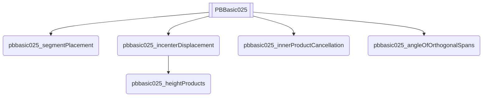

## PB-Basic-026 — Geometry, IMO-medium

*Novel Problem* · 8 nodes · 199 API calls · 27 min

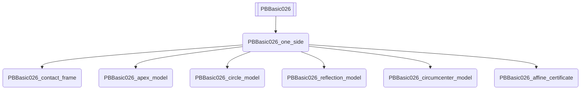

## PB-Basic-028 — Geometry, IMO-medium

*Novel Problem* · 7 nodes · 175 API calls · 27 min

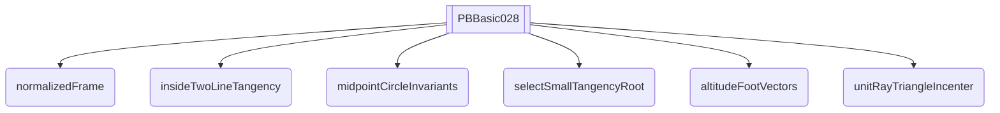

## PB-Basic-029 — Geometry, IMO-medium

*(modified) IMO Shortlist 2008 G5* · 2 nodes · 162 API calls · 57 min

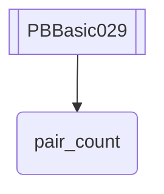

## PB-Basic-030 — Geometry, IMO-easy

*Novel Problem* · 2 nodes · 169 API calls · 97 min

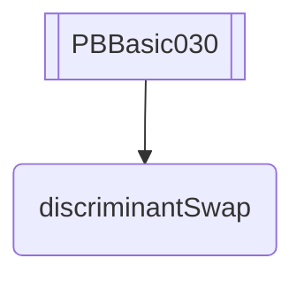

## PB-Advanced-002 — Combinatorics, IMO-medium

*Novel Problem* · 10 nodes · 106 API calls · 21 min

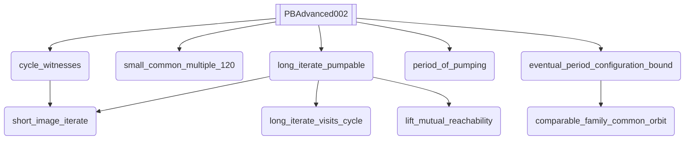

## PB-Advanced-003 — Geometry, IMO-hard

*Novel Problem* · 5 nodes · 674 API calls · 221 min

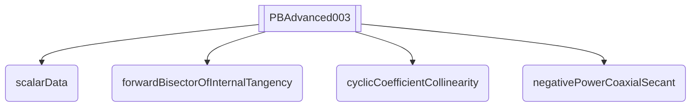

## PB-Advanced-004 — Combinatorics, IMO-easy

*Novel Problem* · 5 nodes · 88 API calls · 18 min

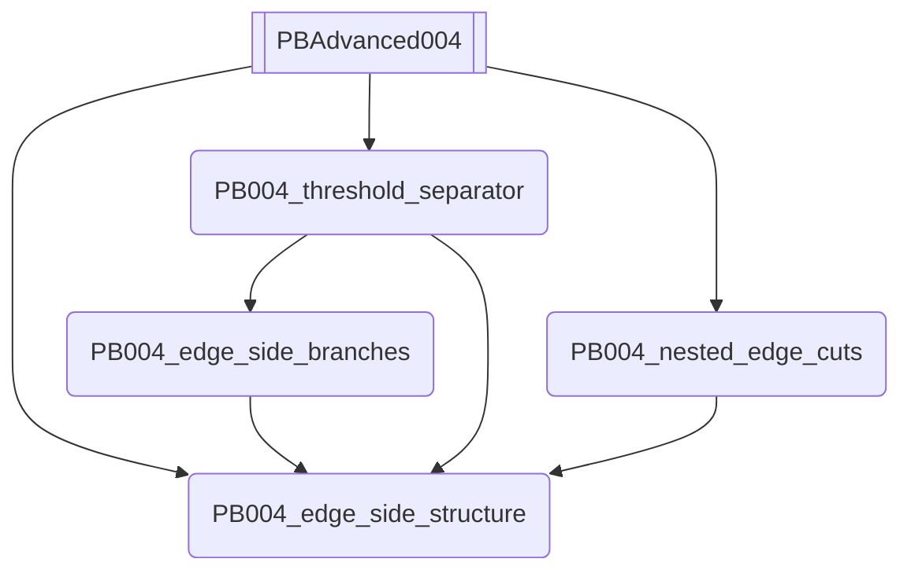

## PB-Advanced-005 — Geometry, IMO-medium

*Novel Problem* · 6 nodes · 105 API calls · 24 min

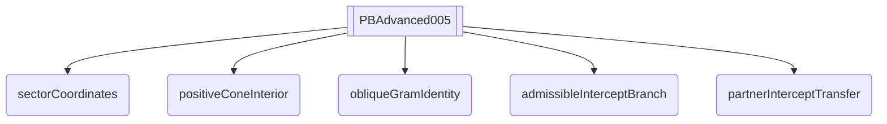

## PB-Advanced-009 — Geometry, IMO-hard

*Novel Problem* · 1 nodes · 200 API calls · 84 min

## PB-Advanced-010 — Geometry, IMO-medium

*Novel Problem* · 8 nodes · 158 API calls · 44 min

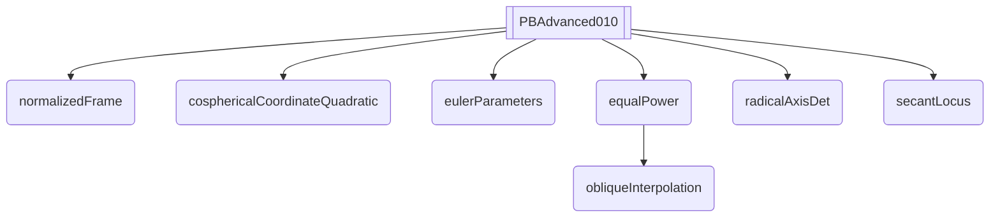

## PB-Advanced-015 — Geometry, IMO-hard

*Novel Problem* · 10 nodes · 323 API calls · 53 min

```mermaid
flowchart TD
    n_n_a3ef6b7bd7842923[["PBAdvanced015"]]
    n_pb015_normalize("pb015_normalize")
    n_pb015_tangent_line_sq("pb015_tangent_line_sq")
    n_pb015_orthic_equations("pb015_orthic_equations")
    n_pb015_tangency_relation("pb015_tangency_relation")
    n_pb015_circumcircle_coordinates("pb015_circumcircle_coordinates")
    n_pb015_secant_coordinates("pb015_secant_coordinates")
    n_pb015_internal_bisector("pb015_internal_bisector")
    n_pb015_external_parameter("pb015_external_parameter")
    n_pb015_coordinate_collinear("pb015_coordinate_collinear")
    n_n_a3ef6b7bd7842923 --> n_pb015_normalize
    n_n_a3ef6b7bd7842923 --> n_pb015_tangent_line_sq
    n_n_a3ef6b7bd7842923 --> n_pb015_orthic_equations
    n_n_a3ef6b7bd7842923 --> n_pb015_tangency_relation
    n_n_a3ef6b7bd7842923 --> n_pb015_circumcircle_coordinates
    n_n_a3ef6b7bd7842923 --> n_pb015_secant_coordinates
    n_n_a3ef6b7bd7842923 --> n_pb015_internal_bisector
    n_n_a3ef6b7bd7842923 --> n_pb015_external_parameter
    n_n_a3ef6b7bd7842923 --> n_pb015_coordinate_collinear
```

## PB-Advanced-016 — Geometry, IMO-easy

*Novel Problem* · 7 nodes · 202 API calls · 35 min

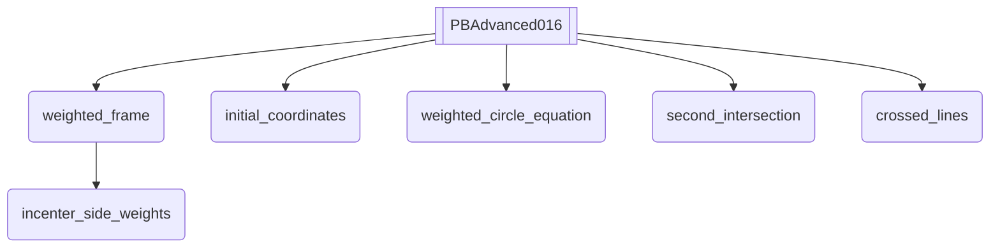

## PB-Advanced-018 — Combinatorics, IMO-hard

*Novel Problem* · 9 nodes · 446 API calls · 94 min

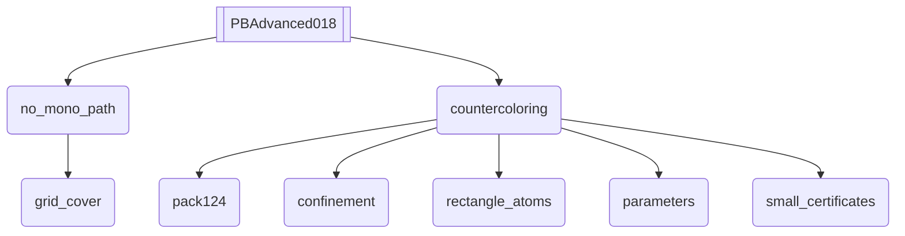

## PB-Advanced-021 — Combinatorics, IMO-hard

*(Modified) IMO 2024 P3* · 12 nodes · 149 API calls · 28 min

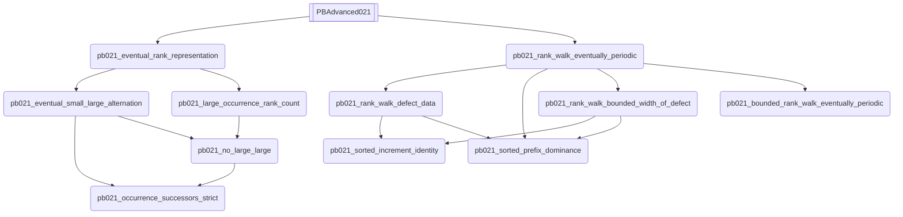

## PB-Advanced-022 — Geometry, IMO-easy

*(Modified) IMO 2024 P4* · 8 nodes · 229 API calls · 30 min

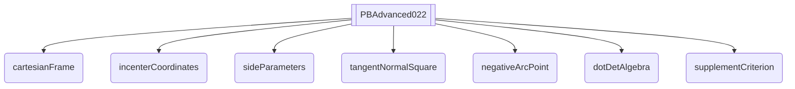

## PB-Advanced-023 — Combinatorics, IMO-medium

*(Modified) IMO 2024 P5* · 7 nodes · 147 API calls · 31 min

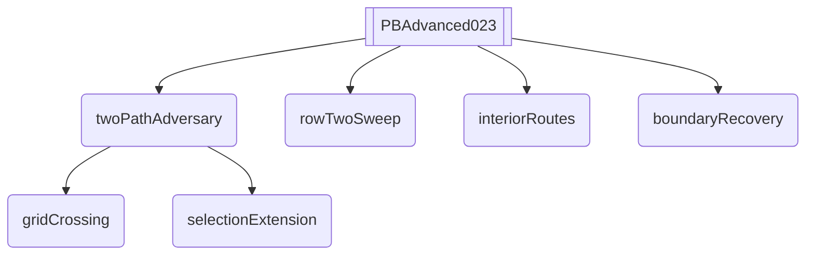

## PB-Advanced-027 — Combinatorics, IMO-hard

*USAMO 2025* · 6 nodes · 62 API calls · 15 min

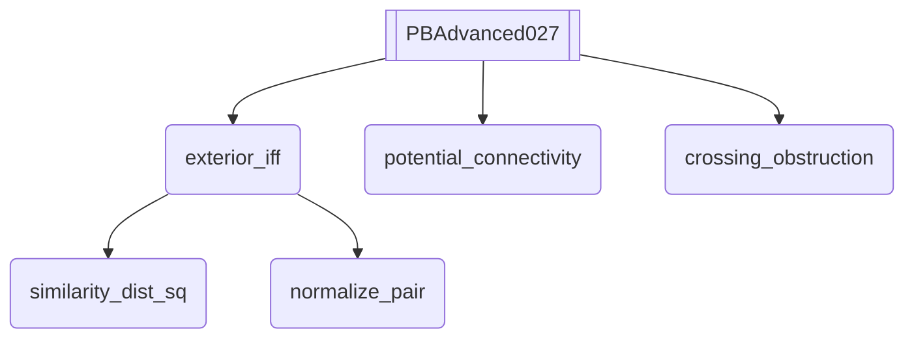
